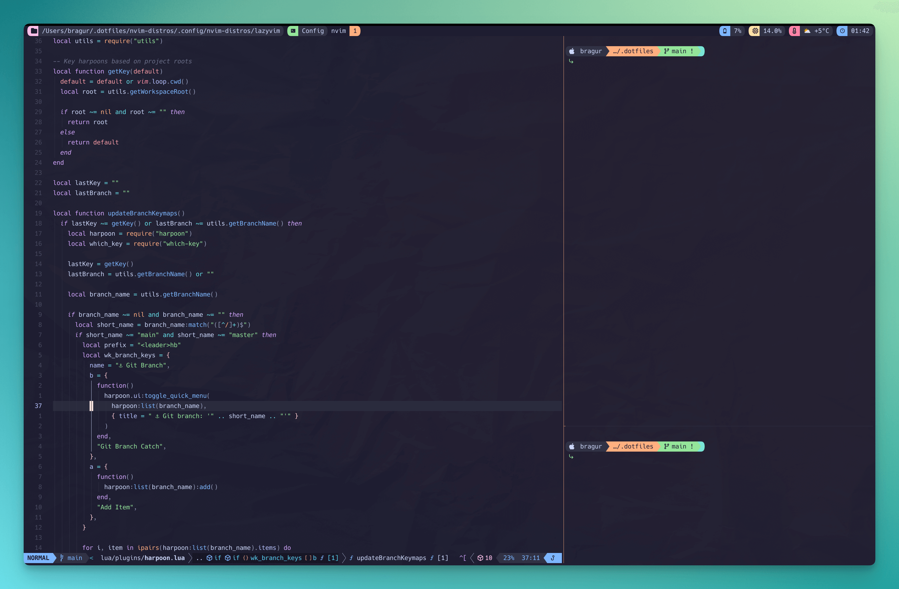

# bragur's Dotfiles

## Introduction

This repository contains dotfiles for various applications and services which I use in my personal daily workflow. It is catered to web development, specifically and mainly in [ReScript](https://rescript-lang.org/). While I strive to be a zero config guy in most cases I’m also enthralled with tinkering and polishing and thus my dotfiles came to life. I don’t necessarily swap machines very often in my professional career but I’d still like for this configuration to be both easily manageable and quickly set up should I find myself in front of a new computer. I also have a little crush on the idea of being able to run my shell on a powerful workstation via [Tailscale](https://tailscale.com/) and use ssh on any terminal I wish to use on the other end to achieve a light, portable and powerful setup from anywhere. I haven't even tried this and it might be awful. But the dream lives on.



## Usage

Feel free to use my config as you will, however they may be opinionated in various ways. Configs are highly user specific so in mine, for instance, Neovim is configured to accommodate mostly for writing code in ReScript and JS but there may be some nice reusable bits in between.

Start by cloning this repository via `git clone git@github.com:bragur/dotfiles.git $HOME/.dotfiles`. To symlink the configuration for any of the tools which are in the repository use [`stow`](https://www.gnu.org/software/stow/), for instance to symlink the zsh configuration run `stow zsh` or `stow` followed by the folder name in the root of the repository. Symlinking is an easy way to keep all of your configs in one place and using stow makes the process of the symlinking itself easier. You can think of each directory in the root as a package and each package acts as if it were your home directory. So running stow on a _package_ will essentially look in that directory and symlink the contents of it to your home directory:

```sh
# For zsh
$ stow zsh
zsh/.zshrc -> $HOME/.zshrc
zsh/.config/zsh/* -> $HOME/.config/zsh*
# etc...
```

## Configurations

### Theme

I've been experimenting with [Catppuccin](https://github.com/catppuccin/catppuccin), the soothing pastel theme for the high-spirited. It tunes in nicely with [tmux](https://github.com/tmux/tmux/wiki), [Starship](https://starship.rs/) and [Neovim](https://neovim.io/).

### [Wezterm](https://wezfurlong.org/wezterm/index.html)

In my environment I've been trying on Wezterm and so far I like it. It's fast and snappy, which is a concern I've had when running the emulator on large screens. For some reason iTerm won't quite cut it for my Neovim/tmux configuration and scrolling becomes cumbersome, especially when having 2 or more windows open at a time. It's a very slim configuration with the Catppuccin theme and slight modifications of keybindings.

### [zsh](https://www.zsh.org/) and [Antidote](https://getantidote.github.io/)

I run the Z shell command line and have set up the usual suspects plugin-wise for better UX and a little bit of fishness. It's a fairly slim config which uses antidote for plugin management. I have some utility functions such as switching nvim configurations easily if I'm playing around.

#### [Starship](https://starship.rs/)

I use the Starship prompt with a slightly modified Gruvbox Rainbow preset replacing the colors with the Catppuccin palette. I've also trimmed out some items which I don’t have a need for, such as the time, which tmux already displays for me (see below).

#### [tmux](https://github.com/tmux/tmux/wiki)

I run a multiplexer on top of Wezterm called tmux, mostly for session retrievals and to be somewhat on the terminal emulator agnostic side in terms of key bindings. I have some plugins to make my life easier and key maps for pane navigation which are identical to what I use in Neovim so navigating between panes is pane free 🤔.

The status line uses the Catppuccin theme with some additional information such as battery and cpu status along with the time. It is also configured to be on top.

#### [tmuxifier](https://github.com/jimeh/tmuxifier)

Complimenting tmux is tmuxifier where I have a set of layouts to easily be able to start up my ideal environments, i.e. something like Neovim on the left and then a couple of stacked panes on the right, one with a watching compiler and my web server below that. This I can then toggle in and out, especially when moving to a laptop screen. It's useful for larger screens as well as sometimes I might add another pane between my two main sections to run tests and it's quite handy to be able to get those informational screens out of the way when my brain cells need some space.

### [Neovim](https://neovim.io/)

I run a little configuration on top of [LazyVim](https://www.lazyvim.org/) adding seamless navigation between windows in Neovim and to tmux panes and back. I feel the built in terminals for Neovim are a little fiddly so I rely more on tmux for my workflow and it rocks for my purposes. You will find my specific config [here](https://github.com/bragur/dotfiles/tree/main/nvim-distros/.config/nvim-distros/lazyvim/lua). My [keymaps](https://github.com/bragur/dotfiles/tree/main/nvim-distros/.config/nvim-distros/lazyvim/lua/config/keymaps.lua) serve the use case of my Icelandic keyboard layout. Specifially any bindings to the option modifier key will be specific to that layout so they will should be reconfigured before usage or they will most likely be useless.
